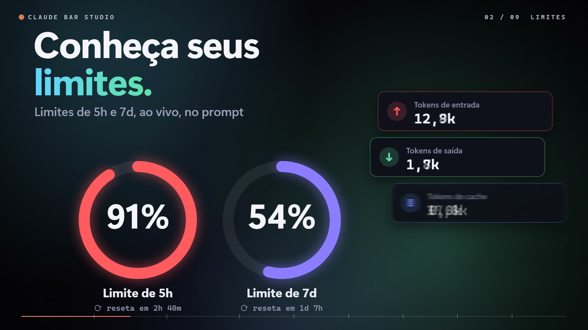
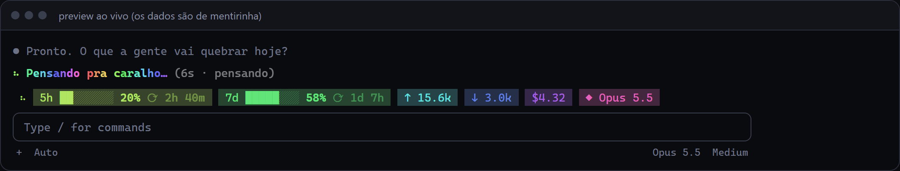
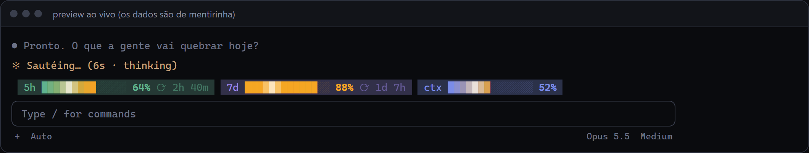
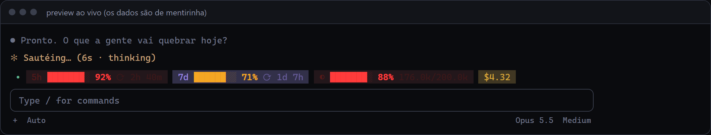
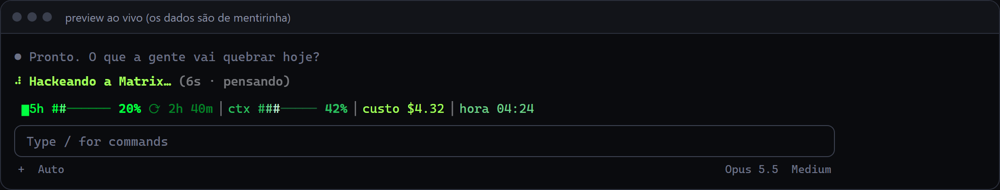

# Claude Bar Studio

[](https://touchzada.github.io/claude-bar-studio/)

**[Página do projeto, com vídeo](https://touchzada.github.io/claude-bar-studio/)**

| | |
| --- | --- |
|  |  |
|  |  |

*Os prints são do preview do painel, com dados simulados.*

Personalize o seu Claude Code: uma **faixa acima do prompt** com limites 5h/7d, tokens, custo, contexto e mais, **animações** (arco-íris, respirar, brilho, letreiro…), **spinner em português**, linha de fim de turno, dica sob o prompt e **alertas**. Tudo configurado por um painel visual no navegador.

São duas peças:

| Pasta | O que é |
| --- | --- |
| `mod/usage-band` | O mod (plugin de hooks) que desenha tudo dentro do Claude Code. |
| `panel` | O painel (Node, sem dependências) onde você liga/desliga itens, escolhe cores, presets e vê o preview ao vivo. |

O painel grava `~/.claude/usage-band.json`; o mod confere esse arquivo a cada ~2 segundos e redesenha. Não precisa reiniciar nada.

## O que dá pra mostrar

- **Limites:** 5 horas, 7 dias, limite de gasto (gateway), com barra, % e tempo até resetar.
- **Tokens:** entrada ↑, saída ↓, cache ≣, taxa de cache hit, total.
- **Custo:** da sessão (em US$ ou R$ com cotação), por mensagem, ritmo em $/h.
- **Contexto:** % da janela usada.
- **Sessão:** modelo, nº de mensagens, tempo de sessão, último turno, relógio, pasta do projeto.

Estilos: pílulas, texto simples, colchetes ou letreiro rolando. 10 paletas, 5 estilos de barra, alertas de cor (amarelo/vermelho), gradiente de termômetro, 21 presets prontos.

**Animações:** arco-íris, respirar, brilho, pulsar alerta, disco, indicador de atividade girando.

**Extras:** spinner com suas palavras (rotativas e em arco-íris), "Baked for 3s" com palavra sua, dica sob o prompt com variáveis (`{5h}`, `{cost}`, `{model}`…) e toasts de alerta (limite, contexto, custo, turno longo).

O painel tem uma aba **"O que é cada coisa"** explicando cada item e conceito (token, cache, janela de 5h/7d…).

## Como usar

Requisitos: **Claude Code** com suporte a mods/plugins de hooks (recurso em acesso antecipado; testado na 2.1.286) e **Node 18+** pro painel.

### 1. Carregar o mod

```bash
claude --plugin-dir /caminho/para/claude-bar-studio/mod/usage-band
```

### 2. Abrir o painel

```bash
node panel/server.js
```

Abre em http://127.0.0.1:4747 (no Windows também dá dois cliques em `panel/start.bat`). Mexeu, a barra muda em ~2s. O servidor só escuta em `127.0.0.1`.

## Observações honestas

- As barras 5h/7d só existem em conta com **assinatura**; sem ela, os itens de limite somem sozinhos.
- O custo em $ é a estimativa do Claude Code (igual ao `/cost`); em assinatura não é cobrança extra.
- As animações redesenham a faixa algumas vezes por segundo. Se o terminal piscar demais, use a velocidade "lenta" ou desligue.
- A API de mods ainda muda entre versões do Claude Code; se algo quebrar depois de um update, abra uma issue.
- O caminho de instalação com `--plugin-dir` segue a documentação dos mods, mas não foi testado de ponta a ponta numa instalação limpa.
- O mod foi validado com `claude plugin validate` e montado no engine real em 25 combinações de visual × animação (terminal e desktop). Alertas e animações não foram observados rodando numa sessão ao vivo por quem escreveu; relatos são bem-vindos.

## Estrutura

```
mod/usage-band/
  .claude-plugin/plugin.json
  hooks/hooks.json
  hooks/register.tsx     # a faixa, spinner, fim de turno, dica e alertas
  types/index.d.ts       # contrato do estado e do config
panel/
  server.js              # serve o painel e lê/grava ~/.claude/usage-band.json
  index.html             # o painel (preview, itens, estilo, extras, presets, glossário)
  start.bat              # atalho no Windows
```
